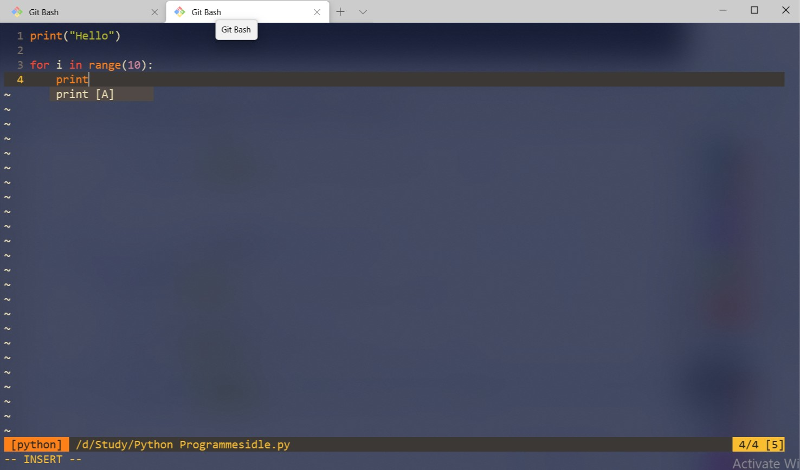

# Vim-Config (only for vim not neovim)
* This is the vim config file. If you're a new vim user then it will help you to work in vim better than before.


## Demo


## Pre-requisites
* [Vim](#vim)
* [Git Bash](#git-bash)


### First Download and Install Vim
[Download Vim](https://www.vim.org/download.php)

### Run the Below Command
* Unix
```
curl -fLo ~/.vim/autoload/plug.vim --create-dirs \
    https://raw.githubusercontent.com/junegunn/vim-plug/master/plug.vim
```

* Windows PowerShell
```
iwr -useb https://raw.githubusercontent.com/junegunn/vim-plug/master/plug.vim |`
    ni $HOME/vimfiles/autoload/plug.vim -Force
```

## Download and copy the .vimrc into home directory


### Run the below command
```
$ mkdir ~/.vim/plugged
$ vim ~/.vimrc

All Plugs will be installed by itself
```

### If you add new plugin
```
Run The Given Vim Command
:PlugInstall
```

### Update the plugins
```
Run The Given Vim Command
:PlugUpdate
```

### [Some Useful Vim Commands/Shortcuts](#some-useful-vim-commands-/-shortcuts)
```
1. Press esc to enter normal mode from insert mode
2. :q (quit)
3. :wq (save and quit)
4. :q! (quit without saving)
5. :u (undo) [More About Undo : https://vim.fandom.com/wiki/Undo_and_Redo]
6. Ctrl-r (redo)
7. tn (New Tab)
8. tj (Previous Tab)
9. tk (Next Tab)
10. th (First Tab)
11. tl (Last Tab)
12. h (acts as left arrow <- )
13. l (acts as right arrow -> )
14. k (acts as up arrow ^ )
15. j (acts as right arrow v )
16. Ctrl-n (nord tree)
17. :e (edit file)
18. Ctrl-w-w (goto next window)
19. :sp (split screen horizontally)
20. :vsp (split screen vertically)
21. /word/words (word search)
22. :buffers (to see all buffers that have been performed)
```
